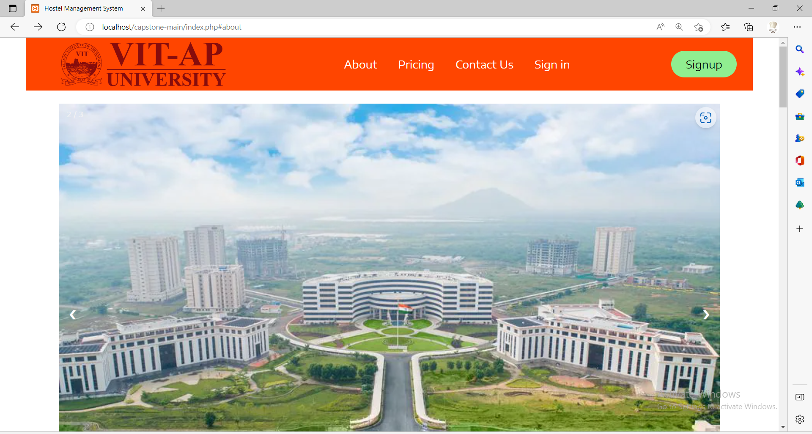
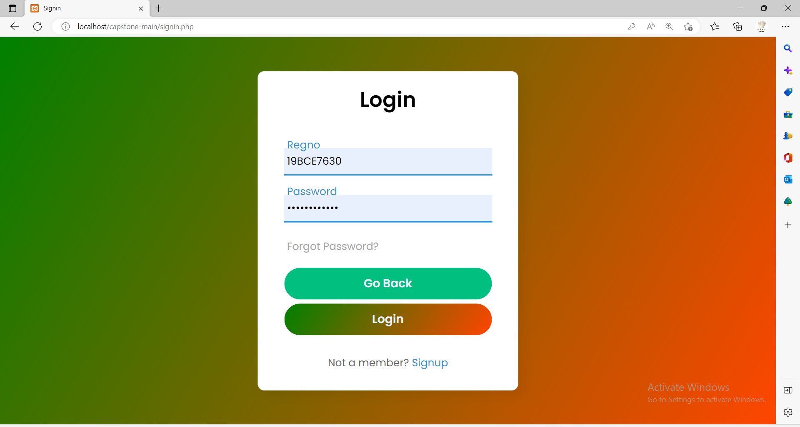
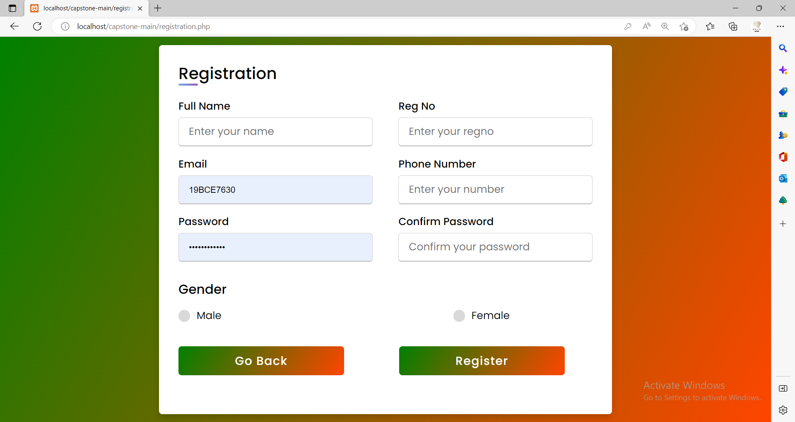

# Hostel Management System

## Overview

Bachelor's web development project for managing hostel-related student workflows.  
It includes student registration, login, room details, leave requests, and admin-side management using PHP, CSS, and MySQL.

## Features

- Student registration and login
- Admin login and dashboard
- Hostel room details and student search
- Student room details & roommate search
- Leave request (apply / approve / reject)
- Pricing, About, and Contact pages

## Tech Stack

- PHP
- MySQL
- HTML / CSS
- XAMPP (localhost)

## Project Structure

Important files in this repository include:

- `index.php` : landing page
- `signin.php` / `registration.php` : student authentication pages
- `adminlogin.php` / `admindashboard.php` : admin-side access and dashboard
- `roomdetails.php` / `studentroomdetails.php` : room information pages
- `leaverequests.php` / `applyleave.php` : leave management features
- `hms.sql` : database schema / SQL file
- `connect.php` / `dbConnect.php` : database connection setup

## Screenshots

### Landing Page

### Login Page

### Registration Page

## How to Run

1. Install XAMPP or any local PHP + MySQL environment.
2. Copy the project folder into your `htdocs` directory.
3. Import `hms.sql` into phpMyAdmin.
4. Update database credentials in `connect.php` or `dbConnect.php` if needed.
5. Start Apache and MySQL.
6. Open the project in your browser using `http://localhost/<your_project_folder>`.

**Default Admin Login**  
Employee ID: `54672`  
Password: `19MIS0240`

## Notes

This repository is being shared as a bachelor's project and represents an academic web application prototype focused on basic hostel management workflows and basic UI pages rather than production-grade deployment or security hardening.

## Future Improvements

- Improve folder structure by separating assets, views, and backend logic
- Password hashing + prepared statements
- Add form validation and stronger authentication handling
- Improve UI consistency and responsive design
- Deploy on a public demo server

